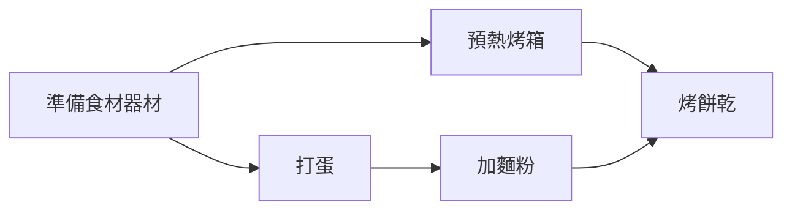

## 簡介
* 起初為 AirBnB 數據團隊的開發，並將代碼捐贈給 Apache 基金會供大眾使用
* 是一個以編程方式創作、安排和監控的工作流程管理平台
* 通過有向無環圖（Directed Acyclic Graphs，DAGs）方式管理任務（Tasks）
* 與多項平台（Hive、MySQL、GCP、AWS…）相容
* 提供 WebUI 查看各項任務間的依賴關係、執行進度、錯誤訊息等

### DAGs
有方向性，但不會循環  
EX：以做餅乾為例，正常情況下不會烤餅乾完又在打蛋下去  


### 優缺點
優點：
* 開源，網上很多相關資源可以查詢
* 靈活，可以運行在一個大 server 或多個小 server 上
* 高延展，通常佈署在單一 server，但也可以在 docker 容器、筆電本地開發
* 支援雲環境

缺點：
* 需要 python 語言知識
* 需要特定 python code 的編寫結構才能執行
    
## 其他開源的工作流程管理工具
* Luigi：具較少功能但相對 Airflow 更容易上手，相對可快速應用工作流程管理
* Argo：已經熟悉 Kubernetes 生態系統，並希望將所有任務用 YAML 編排
* Kubeflow：已經熟悉 Kubernetes 生態系統，但想用 Python 編排 ML 工作流
* MLFlow：想用 MLFlow 預定義模式追蹤實驗、部屬模型

## 安裝步驟
經過多個網站交叉比對單純在 windows 上安裝 airflow 不可使用的（測試結果真的不行）  
所以本文紀錄整合資訊完的流程，希望之後有更簡易的方式    
1. Install WSL：跟著官網指示[安裝 WSL](https://docs.microsoft.com/zh-tw/windows/wsl/install-win10#manual-installation-steps)（Windows Subsystem for Linux）
2. Install Ubuntu：開始 ＞ Microsoft Store > 下載 Ubuntu > 安裝後第一次需輸入使用者名稱和密碼


3. Python3 Setting：在 ubuntu 輸入
    1. `sudo apt update` 更新可用版本清單
    2. `sudo apt install python3-pip` 鍵入 `Y` 下載 pip
    3. `python3 --version` 確認 python3 真的存在
4. AirFlow Setting：在 ubuntu 輸入
    1. airflow 儲存資料路徑設置，下列二擇一
        ```
        export AIRFLOW_HOME=~/airflow # 預設路徑
        export AIRFLOW_HOME=c/Users/user_name/AirflowHome # 自訂路徑：user_name 改成自己的名字
        ```
    2. 指定 airflow、python 版本下載
        ```
        AIRFLOW_VERSION=2.1.0
        PYTHON_VERSION="$(python3 --version | cut -d " " -f 2 | cut -d "." -f 1-2)"
        CONSTRAINT_URL="https://raw.githubusercontent.com/apache/airflow/constraints-${AIRFLOW_VERSION}/constraints-${PYTHON_VERSION}.txt"
        sudo pip install "apache-airflow==${AIRFLOW_VERSION}" --constraint "${CONSTRAINT_URL}"
        ```
    3. 初始化資料庫，建立 username、password 以登入 UI 介面
        ```
        airflow db init
        airflow users create --role Admin --username admin --password admin --email admin@example.com --firstname admin --lastname admin
        ```
5. 成功安裝的畫面如下：


## 本次安裝軟體彙總表
軟體|版本
---|---
WSL|2
Ubuntu|20.04 LTS
Python|3.8.5
AirFlow|2.1.0

## 常用 Ubuntu 指令
sudo 是讓用戶安全地用盡量低的 root 權限就可以執行任務  
詳細 sudo 介紹可以看[這篇文](http://note.drx.tw/2008/01/linuxsudo.html)寫得蠻清楚的  

指令|意義
----|----
pwd |顯示目前所在路徑
ls -a|顯示當前目錄下所有資料夾，包含隱藏檔
ls /mnt/c|顯示 C 槽下所有內容
sudo nano {file_path}|編輯檔案內容（ctrl + s ＞ ctrl + x，存檔並離開）
sudo apt-get update|取得遠端更新伺服器的套件檔案清單

## 參考來源
* [Running Airflow on Windows 10 & WSL](https://www.astronomer.io/guides/airflow-wsl)
* [Running Airflow locally](https://airflow.apache.org/docs/apache-airflow/stable/start/local.html)
* [Run Apache Airflow on Windows 10 without Docker](https://towardsdatascience.com/run-apache-airflow-on-windows-10-without-docker-3c5754bb98b4)
* [Airflow 1.8 工作流平台搭建](https://blog.csdn.net/kk185800961/article/details/78431484)
* [在 Ubuntu 18.04 上安装部署 Airflow 1.9.0](https://liaocy.net/2018/20180714-airflowdeploy/)
