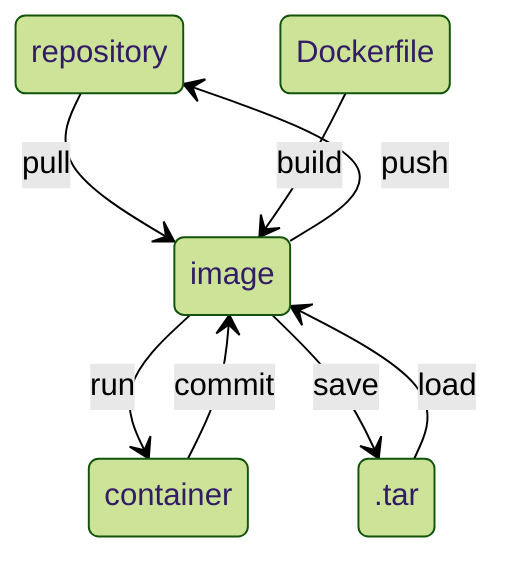

## 關係圖

* Dockerfile：如何 build 成 image 的步驟寫於此文件

## 運行語法
|語法|意義|
|----|----|
|`docker pull mysql 版號`|將特定版號 mysql 的 image 下載下來；不加版號則下載最新版|
|`docker images`|查看當前 repository 有哪些 image|
|`docker run -d -p 90:80 mysql --name your_name`|`-d`用後臺執行；`-p 90:80`指定外部端口 90 映射內部端口 80，並將此 constainer 命名為 your_name|
|`docker ps`|查看所有正在運行的 constainer id 有哪些|
|`docker exec -it constainer_id bash`|進到該 constainer_id 的 container 進行操作|
|`exit`|退出該容器|
|`docker rm -f constainer_id`|強制刪除某 constainer_id 的 constainer|
|`docker commit constainer_id its_name`|將命名為 its_name 的 constainer_id 上傳到 repository|
|`vim Dockerfile`|新建 Dockerfile 文件|
|`docker build -t image_name .`|`.` 表當前目錄下的 Dockerfile，將其建立成 image|
|`docker save -o your_name.tar image_name`|將指定 image 壓縮存為 your_name.tar|
|`docker rmi image_name`|刪除指定 image|
|`docker load -i your_name.tar`|載入指定 your_name.tar|

* 此處的 constainer_id，可僅打能分辨不同 container 的前幾碼即可

## Dockerfile 語法
|語法|意義|
|----|----|
|`FROM mysql`|指定 Dockerfile 的基礎 image 為 mysql |
|`ADD ./ your_path`|將當前所有檔案複製到指定路徑下|

## 參考資源
* [線上版 docker](https://labs.play-with-docker.com/)
* [Docker 語法](https://joshhu.gitbooks.io/dockercommands/content/DockerImages/CommandArgs.html)
