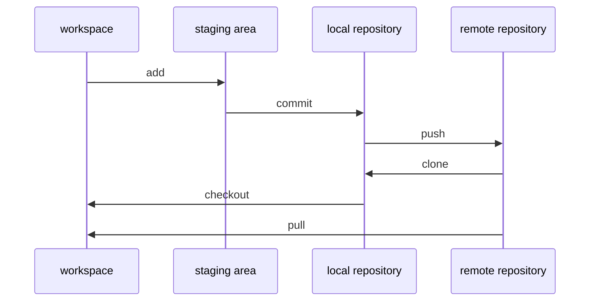

## 開始安裝
[官方網站主頁](https://git-scm.com/)  
[官方 windows 下載連結](https://gitforwindows.org/)  
基本上按著預設一直點下去到安裝完為止即可  
接下來只要在開始就可以叫出 Git Bash 下指令  
或是在各個專案點右鍵也會出現 Git Bash 的選項，開啟即是專案路徑

## 使用建議
* 非必要，不要上傳 RAW DATA
* 不要上傳任何跟帳密相關的資訊
* 不要上傳任何跟個資相關的 LOG、資料等
* 可以用 [.gitignore](https://github.com/yuning-lin/EnvironmentSetup/blob/main/Git/Ignore.md) 做管理

## 圖示簡介  
剛開始直接讀 git 語法沒有這種圖，對架構總是有點霧煞煞  
有這種圖表示每個動作大致的關係，新手應該較能理解  



## 建立連結
地端必須產生金鑰，並且必須告訴遠端金鑰為何  
如此從遠端 clone 到地端的資料夾才能和遠端做連結  
[參考網址](https://docs.github.com/en/authentication/connecting-to-github-with-ssh/checking-for-existing-ssh-keys)完成以下步驟即可  
1. 開啟終端機鍵入 `ls -al ~/.ssh` 觀察是否曾建立金鑰
2. 若出現 `No such file or directory`，則創建新金鑰；若有的話從第４步開始繼續做
3. `ssh-keygen -t ed25519 -C "your_email@example.com"` 一路按 Enter 即可，隨後即可在 `/Users/your_name/.ssh` 找到 .pub 檔
4. `eval "$(ssh-agent -s)"` 將 SSH key 加入 ssh-agent
5. `nano ~/.ssh/config` 建立 config 並編輯 > 貼上下框文字 > control + X > y > Enter，儲存並離開
      
    ```
    Host *
    AddKeysToAgent yes
    UseKeychain yes
    IdentityFile ~/.ssh/id_ed25519
    ```
6. `ssh-add -K ~/.ssh/id_ed25519` 將 SSH key 加入 ssh-agent 並把密碼存於 keychain
7. `pbcopy < ~/.ssh/id_ed25519.pub` 以複製金鑰（ 開頭會是 ssh-ed25519 結尾是 email ）
8. 在 github 首頁 > Settings > 點選左列 SSH and GPG keys > New SSH key 貼上剛剛複製的金鑰即可
9. 接下來可以在任意專案上利用 SSH clone 專案了

## BASH 快捷鍵
快捷鍵|意義
----|----
shift + Q | 換行
ctrl + C | 暫停執行

## 參考來源
* [連猴子都能懂得 Git 入門指南](https://backlog.com/git-tutorial/tw/intro/intro2_1.html)
* [為你自己學 Git](https://gitbook.tw/)
* [Git Commit Message 這樣寫會更好，替專案引入規範與範例](https://wadehuanglearning.blogspot.com/2019/05/commit-commit-commit-why-what-commit.html)

