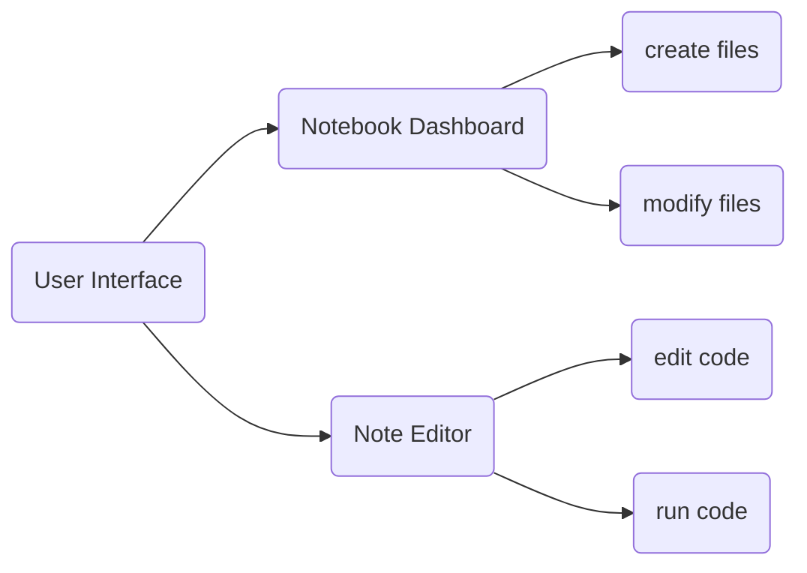

## 簡介
Jupter Notebook 是一個 Web-based 的程式開發工具  
可以利用網頁即時反饋數學計算、文字編輯等功能  
本身支援的 kernel 非常多樣化，常見的有 Python、R、C# 等  
在 github 上用 .ipynb 也可以將運行的圖直接帶入 repository  
個人經驗在專案初期使用 Jupyter Notebook 的 cell 區隔不同功能的程式也有不錯的管理程式效果  

## 如何安裝
1. 先安裝 python3.3 以上的版本，步驟可見[此文](https://github.com/yuning-lin/EnvironmentSetup/blob/main/Python/README.md)
2. 使用 Anaconda 或 pip 安裝 Jupter Notebook
```
pip3 install --upgrade pip
pip3 install notebook
```
3. 利用 CMD 鍵入 `jupyter notebook` 或是在 windows --> 開始找到 jupyter notebook 後開啟
  
## 如何使用
開啟後介面如下
  

  
功能大致可以切分如流程圖

### Notebook Dashboard
在右上角 New 可以新增 .ipynb 檔案、資料夾等
  

  
將檔案做更名、移動、刪除，並且可以藉由檔案顏色辨別是否仍在運行  
  

  
### Note Editor
基本運行功能可以用點選 ICON 執行或是另行點選選單  
  

  

#### 快捷鍵：
  
快捷鍵|功能
-----|-----
shift + enter|執行並新增 cell 於下方
ctrl + /|註解程式內容
ctrl + enter|執行指定 cell

#### 選單常用功能：
* 另存檔案成 .py
  

  
* 編輯操作 cell，如指定向上、向下插入 cell
  


* 運行 cell 並可以改變運行 cell 程是內容為 markdown 語言 
  

  
* 中止或暫停程式運行
  

  
