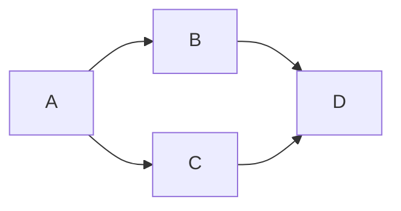
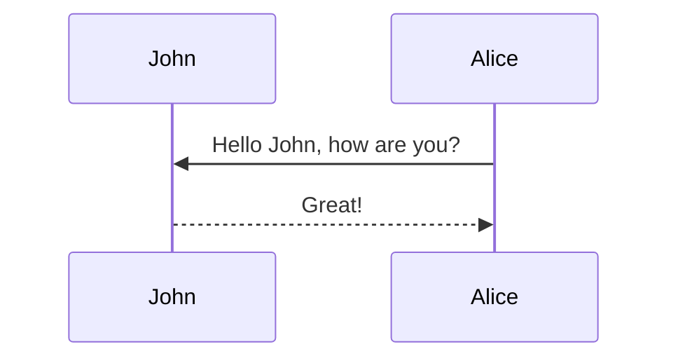
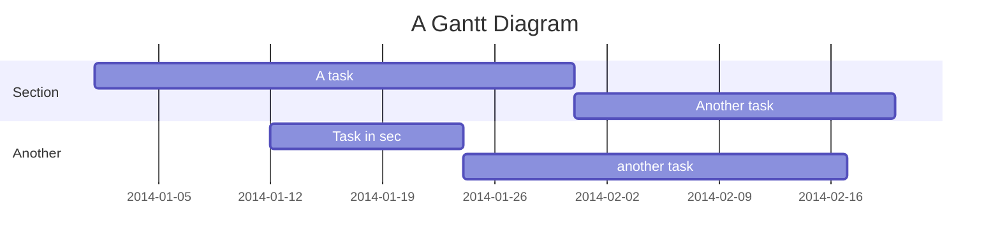

## github markdown 進階用法
* 合併儲存格
  1. 於 WORD 製作表格
  2. 檔案另存新檔為網頁（.htm, .html）
  
  
  
  4. 開啟網頁後複製 table 標籤內容
  
  
  
  6. 將標籤內容直接貼於 .md 檔內（無須用 ``` 上下包裹）
* 流程圖、甘特圖等進階圖形
  1. [安裝網頁擴充工具](https://github.com/BackMarket/github-mermaid-extension)
  2. 利用 ```mermaid 包裹欲呈現圖形的相應程式語言
  3. [更多範例詳見官網](https://mermaid-js.github.io/mermaid/#/README)（下列呈現有嘗試成功的案例）
  4. [即時 mermaid 語言圖示化網頁](https://mermaid-js.github.io/mermaid-live-editor/edit#eyJjb2RlIjoiZ3JhcGggVERcbiAgICBBW0NocmlzdG1hc10gLS0-fEdldCBtb25leXwgQihHbyBzaG9wcGluZylcbiAgICBCIC0tPiBDe0xldCBtZSB0aGlua31cbiAgICBDIC0tPnxPbmV8IERbTGFwdG9wXVxuICAgIEMgLS0-fFR3b3wgRVtpUGhvbmVdXG4gICAgQyAtLT58VGhyZWV8IEZbZmE6ZmEtY2FyIENhcl1cbiAgIiwibWVybWFpZCI6IntcbiAgXCJ0aGVtZVwiOiBcImRlZmF1bHRcIlxufSIsInVwZGF0ZUVkaXRvciI6ZmFsc2UsImF1dG9TeW5jIjp0cnVlLCJ1cGRhdGVEaWFncmFtIjpmYWxzZX0)
## mermaid 使用範例
### 流程圖
測試結果紀錄：
* 語法遇到 `[]` 都會有錯誤訊息
  * Mermaid syntax error：Expecting 'SPACE', 'GRAPH', 'DIR', 'TAGEND', 'TAGSTART', 'UP', 'DOWN', 'subgraph', 'end', 'MINUS', '--', '==', 'STR', 'STYLE', 'LINKSTYLE', 'CLASSDEF', 'CLASS', 'CLICK', 'DEFAULT', 'NUM', 'PCT', 'COMMA', 'ALPHA', 'COLON', 'BRKT', 'DOT', 'PUNCTUATION', 'UNICODE_TEXT', 'PLUS', 'EQUALS', 'MULT', got 'PS'
* classDiagram 無法使用
  * Mermaid syntax error：Expecting 'CLASS', 'MEMBER', 'SEPARATOR', 'UNICODE_TEXT', 'NUM', 'ALPHA', got 'EOF'
* journey、pie 無法使用
  * Mermaid syntax error：Expecting 'NEWLINE', 'SPACE', 'GRAPH', got 'ALPHA'

``` 
    ```mermaid
    graph LR;
        A-->B;
        A-->C;
        B-->D;
        C-->D;
    ``` 
```



``` 
    ```mermaid
    graph TD;
      id1((top))---id2((down))
      style id1 fill:#f9f,stroke:#333,stroke-width:4px
      style id2 fill:#bbf,stroke:#f66,stroke-width:2px,color:#fff,stroke-dasharray: 5 5
    ``` 
```


### 時序圖
```
    ```mermaid
    sequenceDiagram
        participant John
        participant Alice
        Alice->>John: Hello John, how are you?
        John-->>Alice: Great!
    ```
```


### 甘特圖
```
    ```mermaid
    gantt
        title A Gantt Diagram
        %% this is a comment
        dateFormat  YYYY-MM-DD
        section Section
        A task           :a1, 2014-01-01, 30d
        Another task     :after a1  , 20d
        section Another
        Task in sec      :2014-01-12  , 12d
        another task      : 24d
    ```
```

 
 
 
 
 
